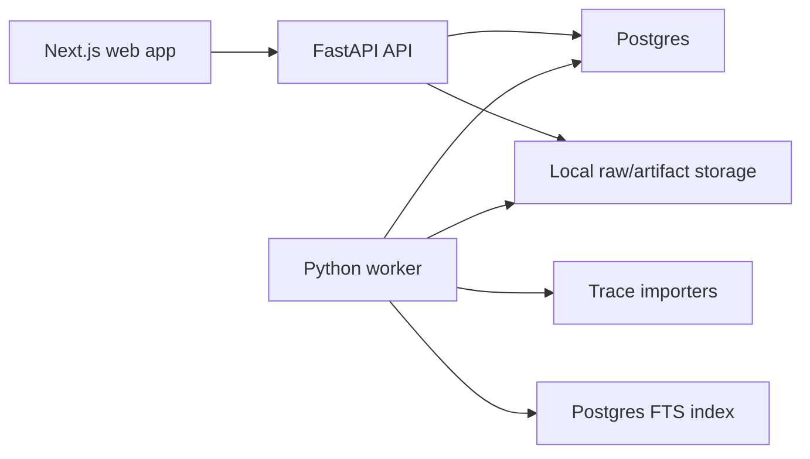

# Architecture Proposal

## Status

Proposed, not accepted. This document should guide the first implementation pass and then be split into smaller accepted decisions once the user confirms the material choices.

## Goals

- Build a runnable local website for uploading, inspecting, searching, sharing, and downloading AI-agent traces.
- Keep the code structure simple enough for a two-day trial while making the data foundation credible.
- Preserve raw trace provenance and derive normalized, searchable records from it.
- Treat uploaded traces as sensitive by default.
- Use Python for backend ingestion, validation, parsing, storage, search, and background work.
- Use Next.js with TypeScript for the web experience.

## Proposed Shape

Use a small monorepo with two application services:

- `apps/web`: Next.js TypeScript frontend.
- `services/api`: Python FastAPI backend.

The frontend should not connect directly to the database. The Python API owns all trace data, ingestion status, parsing, search, visibility, and marketplace state. Next.js consumes the API through generated OpenAPI TypeScript types.

For v1, use Postgres as the only required infrastructure dependency. Postgres can store relational metadata, JSONB normalized attributes, full-text search indexes, and a simple background job table. This avoids adding Elasticsearch, Redis, Celery, S3, or a vector database before the product proves it needs them.

## Repository Layout

```text
trace-marketplace/
  apps/
    web/
      app/
        (dashboard)/
          upload/
            page.tsx
          traces/
            page.tsx
          traces/[traceId]/
            page.tsx
          marketplace/
            page.tsx
        layout.tsx
        page.tsx
      components/
        ui/
        trace/
        upload/
        search/
      features/
        onboarding/
        upload/
        traces/
        search/
        marketplace/
      lib/
        api/
          client.ts
          generated.ts
        formatters/
        routes.ts
      tests/
        e2e/
        unit/
      package.json

  services/
    api/
      pyproject.toml
      alembic/
      src/
        trace_marketplace/
          main.py
          api/
            deps.py
            errors.py
            routes/
              health.py
              onboarding.py
              uploads.py
              traces.py
              search.py
              listings.py
          core/
            config.py
            logging.py
            security.py
          db/
            base.py
            session.py
            models.py
            repositories.py
          ingestion/
            service.py
            validation.py
            storage.py
            normalization.py
          importers/
            base.py
            generic_json.py
            otlp_json.py
          privacy/
            redaction.py
            secret_detection.py
          search/
            indexing.py
            query.py
          jobs/
            runner.py
            handlers.py
            queue.py
          traces/
            schemas.py
            timeline.py
            summaries.py
          listings/
            schemas.py
            service.py
      tests/
        fixtures/
        unit/
        integration/

  fixtures/
    synthetic-traces/
      generic-json/
      otlp-json/

  scripts/
    generate-api-client.sh
    seed-dev-data.sh
    smoke-test.sh

  storage/
    dev/
      raw/
      artifacts/

  docs/
  docker-compose.yml
  Makefile
  README.md
```

Notes:

- `storage/dev` should be gitignored. Committed examples belong in `fixtures/synthetic-traces`.
- Avoid a shared cross-language package unless generated API types make it necessary.
- Keep API route handlers thin. Business behavior should live in feature modules such as `ingestion`, `search`, `traces`, and `listings`.

## Runtime Architecture



Local development should run through Docker Compose:

- `web`: Next.js dev server.
- `api`: FastAPI server.
- `worker`: Python job runner using the same codebase as the API.
- `db`: Postgres.

The local raw store is a filesystem directory. In a production path, the `ingestion.storage` module can swap local disk for S3-compatible object storage without changing parser or API code.

## Frontend Structure

Next.js should be organized around user workflows, not backend tables.

Recommended first pages:

- `/`: lightweight entry point that routes users into contributor and consumer paths.
- `/upload`: contributor upload flow with validation feedback and ingestion status.
- `/traces`: searchable trace library.
- `/traces/[traceId]`: trace inspection page with overview, timeline, spans, events, artifacts, metadata, privacy state, listing controls, and download action when allowed.
- `/marketplace`: thin consumer-facing discovery and download view over public/listed traces.

Recommended component boundaries:

- `components/ui`: low-level reusable controls.
- `components/trace`: trace timeline, span tree, metadata panels, artifact previews.
- `components/upload`: upload dropzone, file list, ingestion progress.
- `components/search`: filter controls, result list, pagination.
- `features/*`: workflow-specific data loading, forms, and state composition.
- `lib/api`: generated API types plus a small typed fetch wrapper.

Frontend rules:

- Prefer server components for initial data loading where practical.
- Use client components for upload progress, search filter state, trace timeline interaction, and visibility/listing toggles.
- Keep backend-sensitive rules out of the frontend. The UI can explain states, but the API enforces ownership, visibility, validation, and redaction.

## Backend Structure

FastAPI should expose a small versioned API:

- `POST /v1/uploads`: create an upload and enqueue ingestion.
- `GET /v1/uploads/{upload_id}`: read upload and job status.
- `GET /v1/traces`: list traces visible to the current identity.
- `GET /v1/traces/{trace_id}`: trace overview.
- `GET /v1/traces/{trace_id}/timeline`: span/event tree for inspection.
- `GET /v1/traces/{trace_id}/download`: download an allowed trace export.
- `GET /v1/search`: keyword and structured trace search.
- `PATCH /v1/traces/{trace_id}/visibility`: change private/shared/listed state.
- `POST /v1/listings`: create or update marketplace listing metadata.

Use Pydantic models for request/response schemas and importer output. Use SQLAlchemy models for persistence. Keep conversion explicit at module boundaries instead of passing ORM objects through the whole app.

The backend modules should have these responsibilities:

- `api`: HTTP routing, dependency wiring, error mapping.
- `core`: config, logging policy, security helpers, app-wide constants.
- `db`: database session management, ORM models, repositories.
- `ingestion`: upload validation, raw storage, parsing orchestration, normalization.
- `importers`: adapters from source formats into the canonical trace shape.
- `privacy`: secret detection, redaction metadata, safe preview creation.
- `search`: index materialization and query translation.
- `jobs`: DB-backed job claiming, retries, and handler dispatch.
- `traces`: read models for timeline and inspection views.
- `listings`: marketplace metadata layered on top of trace visibility.

## Data Model

Use a relational core with JSONB for source-specific attributes that should be preserved but not over-modeled on day one.

Core tables:

| Table | Purpose |
|---|---|
| `users` | Local contributor and consumer identities. Lightweight for v1. |
| `uploads` | One submitted file, archive, folder export, or pasted payload. Tracks owner, source format, hash, size, storage URI, status, and errors. |
| `ingestion_jobs` | Durable background work queue for validation, parsing, enrichment, indexing, and deletion. |
| `traces` | User-visible trace/session records derived from uploads. Stores owner, title, source format, timestamps, visibility, parser version, summary, and status. |
| `spans` | Normalized operations inside a trace: model call, tool call, retrieval step, framework step, user action, or system event. |
| `events` | Timestamped detail inside a span: streamed token chunk, exception, warning, tool output, feedback, or state transition. |
| `artifacts` | Large or sensitive payload references: prompts, completions, files, terminal output, screenshots, retrieved docs. |
| `annotations` | Derived labels, failure signals, eval scores, quality signals, privacy review state, and human feedback. |
| `search_documents` | Materialized safe text and metadata used for Postgres full-text search. |
| `listings` | Marketplace-facing metadata for traces intentionally made discoverable. |
| `audit_events` | Upload, processing, visibility, listing, access, and deletion events without raw trace bodies. |

Canonical trace shape:

- A `trace` is one inspectable user session or request graph.
- A `span` is one meaningful operation with stable IDs, parent-child relationships, timestamps, status, kind, attributes, and optional model/tool metadata.
- An `event` is timestamped detail within a span.
- An `artifact` stores bulky or sensitive content by reference.
- An `annotation` stores derived or human-applied meaning.

Importer-specific fields should live in `source_attributes` JSONB columns with source field paths when useful. Fields needed for search, filtering, or UI comparison should be promoted to columns.

## Ingestion Flow

1. Contributor uploads a trace file from the web app.
2. API streams the upload to a temporary file, validates size/content type, computes SHA-256, and stores the raw payload.
3. API creates an `uploads` row and an `ingestion_jobs` row in one transaction.
4. Worker claims the job and selects an importer based on declared format and sniffed structure.
5. Importer produces a canonical in-memory trace with spans, events, artifacts, and source mappings.
6. Privacy pass detects likely secrets and sensitive values, creates redaction metadata, and produces safe previews.
7. Normalizer writes `traces`, `spans`, `events`, `artifacts`, and `annotations`.
8. Search indexer materializes safe searchable text and structured facets.
9. Upload status changes to `complete` or `failed`, with user-readable errors.

For v1, this can be one worker process using a Postgres job table and row locking. A heavier queue is only justified if parsing or enrichment becomes expensive enough to need distributed workers.

## Importers

Start with an adapter interface:

```python
class TraceImporter(Protocol):
    source_format: str

    def can_parse(self, payload: StoredPayload) -> bool:
        ...

    def parse(self, payload: StoredPayload) -> NormalizedTrace:
        ...
```

Recommended first importers:

- `generic_json`: accepts a simple synthetic trace format for fixtures and demos.
- `otlp_json`: accepts OpenTelemetry-style JSON traces and maps GenAI/OpenInference-like attributes when present.

Do not make Phoenix, Langfuse, or any observability platform a runtime dependency in v1. Treat them as import targets or research references unless a real sample requires deeper support.

## Search

Use Postgres full-text search and structured filters first.

Searchable fields should include:

- trace title and short safe summary
- source format
- model provider and model name
- tool names and tool error states
- span names and statuses
- exception types and short error summaries
- tags, labels, failure-mode annotations, quality signals
- upload date, owner, visibility, listing state

Raw prompts, completions, terminal output, retrieved docs, and uploaded files should not be indexed by default. Index safe derived summaries or redacted previews first. If raw text search becomes a product requirement, make it an explicit privacy decision.

## Privacy And Provenance

Default trace visibility should be private after upload.

Preserve raw uploads, but keep access narrow:

- Raw payloads are stored by hash-derived path.
- Logs never include raw trace bodies, secrets, long prompts, completions, or uploaded files.
- Parsed records link back to `uploads` and `artifacts`.
- Derived records store parser version and source format.
- Redaction state is visible in the UI so contributors know what happened before sharing or listing.

For v1, secret detection should focus on high-confidence patterns such as API keys, bearer tokens, private keys, common service tokens, email addresses, and obvious credentials. Avoid claiming full anonymization unless the system actually transforms the sensitive content.

## Marketplace Layer

Marketplace code should be thin and dependent on trace foundations, not the other way around.

V1 listing behavior:

- Uploaded traces are private.
- A contributor can mark a trace as shared or listed.
- Listed traces appear in `/marketplace` and search results for consumers.
- Consumers can download listed or otherwise allowed trace exports.
- A listing contains title, description, tags, value signals, source format, summary, redaction state, and trace quality signals.
- Payments, licensing, access requests, organizations, and paid purchaser accounts are out of scope for the first build.

This makes the marketplace direction legible without letting commerce features drive the architecture before ingestion and search work.

## Local Development

Recommended commands:

- `make dev`: start Postgres, API, worker, and web.
- `make seed`: load synthetic trace fixtures.
- `make test`: run backend and frontend tests.
- `make smoke`: upload a fixture, wait for ingestion, search for it, fetch the trace timeline, and download an allowed export.

Recommended tooling:

- Python package management: `uv`.
- Python lint/test: `ruff`, `pytest`.
- API framework: `FastAPI`.
- ORM/migrations: `SQLAlchemy`, `Alembic`.
- Web package management: `pnpm`.
- TypeScript API contract: generate from FastAPI OpenAPI into `apps/web/lib/api/generated.ts`.
- Browser smoke tests: Playwright.

## Testing Strategy

Backend tests:

- Importer golden tests with synthetic fixtures.
- Validation tests for malformed, unsupported, duplicate, oversized, and partial traces.
- Privacy tests for high-confidence secret and PII patterns.
- Ingestion integration tests covering upload to parsed trace.
- Search tests for keyword search, filters, visibility, and result ranking basics.
- Repository tests around ownership, listing state, and deletion.

Frontend tests:

- Unit tests for trace timeline transformation and formatting.
- Component tests for upload status, search filters, and trace metadata panels.
- Playwright smoke path: onboard, upload fixture, wait for processing, search, open trace, list trace, download trace.

Contract checks:

- CI or `make test` should fail when the generated TypeScript API client is stale relative to the FastAPI OpenAPI schema.

## Scaling Path

This proposal is intentionally small, but it leaves clear upgrade points:

- Local raw storage can become S3-compatible object storage behind `ingestion.storage`.
- Postgres job table can become Celery, RQ, Temporal, or another queue if workload demands it.
- Postgres FTS can become OpenSearch, Elasticsearch, or a hybrid vector index if search requirements outgrow metadata and full-text search.
- Importers can be added without changing upload or trace inspection code.
- Enrichment can grow from simple deterministic annotations to model-assisted summaries and failure-mode classification.
- Lightweight local identity can become real auth and organizations once access control becomes material.

## Not Recommended For V1

- Kubernetes.
- Microservices.
- GraphQL.
- Separate search infrastructure.
- Separate queue infrastructure.
- Payment processing.
- Paid licensing workflows.
- Full anonymization claims.
- Runtime dependency on Langfuse, Phoenix, or another observability product.

These may become useful later, but they do not directly improve the first evaluation path: upload, validate, preserve, parse, search, inspect, download, and optionally list traces.

## Decisions To Confirm Before Implementation

- First-class demo trace format: generic JSON, OTLP JSON, OpenInference-like JSON, or a provided sample format.
- Whether Postgres is acceptable as the only required local infrastructure dependency.
- Whether raw prompt/output text remains excluded from search by default.
- Whether uploads are private-by-default with explicit listing.
- Whether lightweight local identity is enough for contributor and consumer flows instead of full authentication.
- Whether the first implementation should include a separate worker process or run the same job handlers inline during local development.
