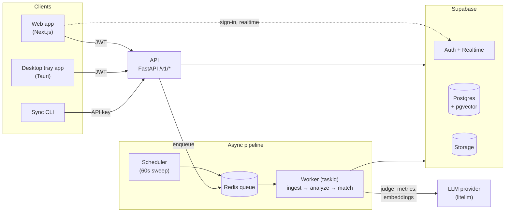
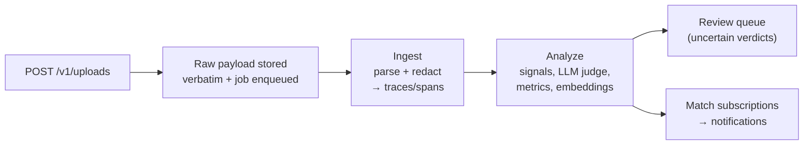

# Architecture Diagram

System-level view of Trace Marketplace. The full narrative lives in [report/02_architecture.md](report/02_architecture.md); this file is just the picture.

## System Diagram

- **Clients**: web app (`apps/web`), sync CLI (`apps/cli`), desktop tray app (`apps/desktop`) — all speak the same upload API. The CLI authenticates with an upload-only `tmk_` API key; web and desktop hold Supabase JWTs (the desktop app also uses sign-in + realtime, omitted above for clarity).
- **Backend** (`services/api`): one Python image, three entrypoints — API, worker, scheduler. The API and worker both read/write Postgres and Storage.

## Upload Data Flow

## Notes

- **Postgres is the source of truth**; Redis holds only in-flight queue messages and rate-limit counters. At-least-once delivery comes from the 60s scheduler sweep, not the broker.
- **Failures are typed** permanent vs transient: transient retries with backoff (5 attempts) then dead-letters to Postgres; permanent fails immediately with a readable reason.
- **Redaction is structural**: the `spans` tables hold the scrubbed form; raw content exists only in the owner-only `span_raw` table and the immutable raw object.
- **Local**: four containers under Docker Compose against a host-run Supabase CLI stack. **Production** ([trace-mp.com](https://trace-mp.com)): the same four containers on ECS Fargate behind ALB + WAF (path routing: `/v1/*` → api, rest → web), ElastiCache Redis, Supabase Cloud — Terraform in `infra/`.
