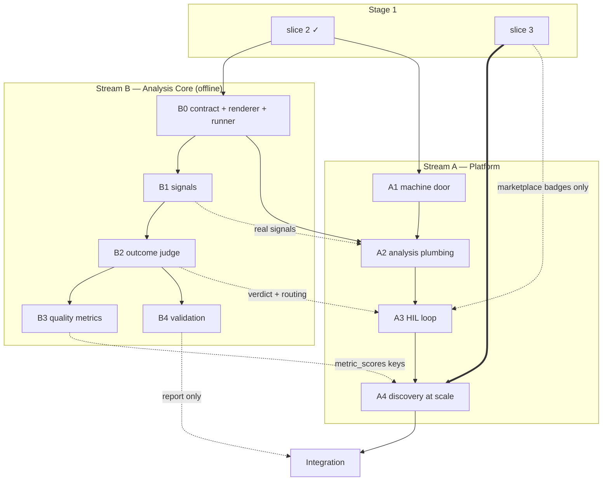

# Build Order

Two parallel streams plus a final integration pass. Stage-1 slice rules carry over: each slice ends runnable and demoable, later slices extend earlier ones without rework, no decisions beyond this spec.

The seam is the **analyzer contract** ([1_analysis.md](1_analysis.md)): analyzers and routing are pure functions over normalized rows, developed against the offline runner — everything touching a database, queue, or browser is the Platform stream. The streams share only the contract module (result models, `trace_analysis` columns, routing reasons), frozen by this spec. Until a B-slice lands, the matching A-slice wires a stub analyzer behind the same contract; swapping in the real one is a registration, not a rework. Both streams are one codebase: stream B is the analysis package inside `services/api`.

**B0 is the one cross-stream ordering constraint** — it creates the contract module everything imports. Stage-1 slice 3 hard-blocks only A4 (and A3's marketplace badges); everything else needs only slices 1–2.

## Dependency Map

Solid = hard prerequisite; dotted = partial dependency (stub or reduced scope suffices until then); thick = the slice-3 gate.

## Stream B — Analysis Core

**B0 — Contract and harness.** Analysis package in `services/api`: typed result models, routing-reason model, config models; the trace renderer + trace→sample adapter; the offline runner (load traces from DB/fixtures, run any analyzer, dump JSON).
*Done when:* any dev-dataset trace renders deterministically within budget; the runner round-trips a stub analyzer; the contract is frozen.

**B1 — Deterministic signals.** Catalog, loop detection, `failure_suspected`; golden tests; hit-rate measurement on the dev dataset locks the promotion list.
*Done when:* golden tests pass; hit-rate report exists; the runner emits signals for every dev-dataset trace.

**B2 — Outcome judge.** Structured-output client; the three composed calls with versioned seeded prompts; self-consistency voting + confidence formula; the routing function; no-key skip.
*Done when:* the runner judges fixtures end to end (votes + reasoning recorded); disagreement/indeterminate/low-confidence fixtures produce the right routing reasons; a keyless run skips cleanly.

**B3 — Quality metrics.** Critics (sourced prompts) + pinned RAGAS collections behind applicability predicates; default-on set; verify RAGAS against our trace shapes.
*Done when:* applicable fixtures produce metric results, inapplicable produce none; default set locked.

**B4 — Validation** (needs B2 only; parallel with B3). Benchmark→OTLP converter (AgentRewardBench + AgentRx); agreement script.
*Done when:* one command produces the agreement report; converter output ingests cleanly.

## Stream A — Platform

**A1 — Machine door.** `api_keys` + dual-auth middleware (the one stage-1 code change) + `uploads.source`; `/settings` (keys, display name, private-trace LLM-analysis toggle — `profiles.allow_private_llm_analysis` migration); the sync CLI ([5_cli.md](5_cli.md)); `/uploads` page; pagination UI on `/traces` and `/uploads`.
*Done when:* fresh compose up → mint key → CLI-sync the dev dataset → watch picks up a dropped file → re-sync uploads nothing → a bad file shows `failed` with its reason on `/uploads`; display name and the LLM-analysis toggle persist through `PATCH /v1/profile`.

**A2 — Analysis plumbing** (consumes B1). `analyzer_results` + `trace_analysis` migrations with RLS; `analyze_trace` job on the existing retry/DLQ machinery, delete-and-rewrite per run, human fields never machine-overwritten; LLM skip paths recorded with reasons (`not_configured`, `owner_opt_out`); derived analysis state in the API; `traces.total_tokens` + trace-name check; trace-detail Analysis section (signals + the four honest states); `/traces` analysis column. (The listing→re-run hook for `owner_opt_out` lands with A4's visibility-event wiring; until then a listed opt-out trace can remain `skipped` — a known interim state, same class as stub analyzers.)
*Done when:* upload → `trace_analysis` row with real signals; keyless and opted-out runs show `skipped` with the right reason, never fake `pending`; re-runs reproduce rows; an injected failure dead-letters and surfaces as `failed`.

**A3 — HIL loop** (consumes B2). `notifications` + `review_items` migrations and endpoints; bell + `/notifications`; `upload_failed` for CLI ingestion failures; routing wiring + per-upload digests + supersede rule; `/review` + `/review/[itemId]` with provenance-writing resolve; owner relabel; label badges on detail and lists.
*Done when:* uncertain fixtures produce digested notifications + queue items with plain-language reasons; resolving updates labels with human provenance; unresolved items leave traces machine-labeled and filterable.

**A4 — Discovery at scale** (needs stage-1 slice 3; consumes B3). Filter-language extension (analysis fields, min-bound predicates, `metric` param, `trace_analysis` join); subscriptions with event-driven matching + feed pages + "Save as subscription"; listing wires the opt-out re-run hook (visibility → listed re-enqueues `analyze_trace` for `owner_opt_out`-skipped traces before matching); bulk acquire / list-unlist (batched consent) / download (zip + `labels.jsonl`).
*Done when:* demo-script steps 6–9 pass end to end.

## Integration

Stage 2 is complete when the full demo script in [0_README.md](0_README.md) passes on a fresh `docker compose up` with real analyzers and an LLM key (smoke script extended; LLM-dependent assertions skipped when keyless), and the B4 report produces the agreement number.

Integration also delivers the **third-party data-flow documentation**: the README/runbook states that analysis sends trace content to the configured LLM provider, names the per-account private-trace opt-out, and the keyless zero-external-flow mode ([0_README.md](0_README.md) Third-Party Services); an `docs/explainers/` entry documents the shipped behavior.

Extensions get their own spec passes before any code, per the standing rule.
