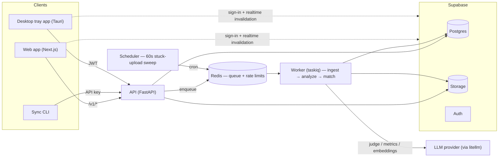

# Architecture

One Python codebase (`services/api`) runs as three Compose services — a FastAPI API, a taskiq worker, and a taskiq scheduler — with Redis as the job broker, Supabase providing Postgres/auth/storage, a Next.js web app, and two stateless clients (sync CLI, desktop tray app) speaking the same upload API. The design stance, recorded in `docs/spec/stage-1/6_architecture.md`: invest in reliability where async work actually happens (ingestion and analysis), keep everything else synchronous, and prefer designs whose state is inspectable in Postgres.

## System Diagram

Locally, the four app containers run under Docker Compose against a host-run Supabase CLI stack. Production runs the same four containers on ECS Fargate against Supabase Cloud (see [External Services](#external-services)).

## Components

### Web App (`apps/web`)

Next.js App Router. All reads and writes go through the API; Supabase is touched directly for exactly two things — auth (browser session, with `src/proxy.ts` refreshing tokens for server components) and realtime *invalidation*: change events on the user's own rows trigger a refetch, but event payloads are never consumed as data, so the API stays the single read path (`src/lib/realtime.ts`). UI components are shadcn/ui themed by `DESIGN.md` tokens, with light/dark schemes via next-themes. API request/response types are hand-mirrored from the API's Pydantic schemas with keep-in-sync markers (`src/lib/api/*.ts`) rather than generated from the OpenAPI schema.

### API (`services/api`)

FastAPI, mounted under `/v1`. Routes stay thin — one router per domain (uploads, traces, bulk, subscriptions, review items, notifications, API keys, profile, health, plus an opt-in `/v1/dev/*` surface for fault injection) — with SQL in one queries module per domain and Pydantic models at every boundary. Middleware adds CORS, correlation IDs (one id follows an upload through ingest → analyze → match across all service logs), and Redis token-bucket rate limiting that fails open if Redis is lost — limit state is not state of record.

Auth (`app/auth.py`) accepts two principals on the same `Authorization` header: Supabase JWTs, verified against the project's JWKS with a per-request email-allowlist check, and `tmk_` API keys (stored sha256-hashed), which authenticate exactly the upload pair — `POST /v1/uploads` and `GET /v1/uploads/{id}` — and nothing else.

The API never parses traces in-request: `POST /v1/uploads` stores the raw object, commits the upload row, enqueues the ingestion job, and returns.

### Worker & Scheduler

Same image as the API, different entrypoints. The task chain is `ingest_upload` → `analyze_trace` (per trace) → `match_trace` (subscription matching → notifications, fired for listed traces). Transient failures retry with exponential backoff up to 5 attempts (`INGEST_MAX_ATTEMPTS`); exhaustion writes a `dead_letters` row in Postgres and marks the work failed — recovery is an explicit `make requeue UPLOAD=<id>`. Permanent failures (typed `PermanentIngestError` / `PermanentAnalysisError`) skip retries and fail immediately with a readable reason.

The scheduler fires one task: `sweep_stuck_uploads`, every 60s, re-enqueuing any upload stuck in `received`/`processing` for more than 10 minutes since its last claim. This sweep — not the broker — is the delivery guarantee (see [Key Invariants](#key-invariants)). Workers scale with `docker compose up --scale worker=N`; nothing else changes.

### Data Layer

Supabase Postgres plus storage. The schema is 14 ordered migrations in `supabase/migrations/` (applied migrations are never edited). Every access rule exists twice — enforced in the API query and mirrored as an RLS policy — which matters because the browser holds a real Supabase session for realtime: delivery is RLS-checked against the subscriber. Storage holds two objects per upload: the immutable raw payload (content-hash keyed) and a scrubbed artifact materialized at ingestion for acquirer downloads. Per-trace embeddings live in pgvector with an HNSW cosine index. Redis holds only in-flight queue messages and rate-limit counters — no state of record.

### Clients

- **Sync CLI** (`apps/cli`, `trace-sync`): stateless `sync`/`watch` over an upload-only API key. No local manifest — the server's per-user sha256 dedupe is the source of truth, so re-syncing any directory from any machine is safe.
- **Desktop tray app** (`apps/desktop`, Tauri): wraps the same watch/upload loop, auto-detects agent session directories, adds native notifications and in-app review resolution. It signs in with Supabase email/password (a JWT principal), not an API key.

Both speak the same `/v1/uploads` API as the web dropzone; upload paths in detail in [03](03_ingestion-and-data.md).

## Key Invariants

- **Postgres, not Redis, is the source of truth.** The Redis list broker has no acks; a lost message costs latency, never the upload. At-least-once delivery + an idempotent consumer + the 60s sweep mean that once a client gets a 201, the upload always terminates in `complete` or in `failed` with a `dead_letters` audit row. Full mechanism and caveats: [docs/explainers/trace-upload-delivery-guarantee.md](../docs/explainers/trace-upload-delivery-guarantee.md).
- **Ingestion is a pure function of the raw stored payload.** Re-running is delete-and-rewrite in one transaction, under stable trace identity (upsert keyed on `owner_id` + `source_trace_id`), so `traces.id` survives re-ingestion and rows hung off it — acquisitions, human-provenance labels, review items — never cascade away. Raw bytes are preserved verbatim — the owner's download serves the stored raw object unchanged, and the smoke script (`tools/smoke.py`) verifies an end-to-end byte-identical download on its fixture.
- **Errors classify as permanent vs transient via typed exceptions** — no blanket retries, and the dead-letter queue is Postgres (durable, queryable), never Redis.
- **Redaction is structural.** The `spans` tables hold the scrubbed form, so every code path reading them — search, inspection, the LLM analyzers — is clean automatically; raw content exists only in the owner-only `span_raw` table and the immutable raw object. Boundary details: [06](06_privacy-and-redaction.md) and [docs/explainers/redaction-boundary.md](../docs/explainers/redaction-boundary.md).
- **Span `attributes`, `events`, and raw payload bodies are never logged.**

## External Services

- **Supabase** — Postgres, auth (JWT/JWKS), storage, realtime. Locally a host-run CLI stack (`supabase start`); in production a supabase.com project.
- **LLM provider via litellm** — the only provider layer, with a single call site (`app/analysis/llm.py`); provider SDKs are never imported. Models are env vars (`ANALYSIS_JUDGE_MODEL`, default `openai/gpt-5-mini`; `ANALYSIS_EMBEDDING_MODEL`, default `openai/text-embedding-3-small`), and per-call latency/tokens/cost are recorded in result metadata. Without a provider key the system runs fully except LLM analysis: the upload→inspect→list→acquire→download loop and the deterministic signals work, and LLM-derived fields stay null with a recorded skip reason — never a fake "pending".
- **Production** ([trace-mp.com](https://trace-mp.com), Terraform in `infra/`) adds AWS around the same four containers: ECS Fargate, an ALB + WAF with path routing (`/v1/*` → api, rest → web — one domain, no CORS), ElastiCache Redis over TLS, secrets in SSM Parameter Store, CloudWatch logs, and GitHub Actions deploys via OIDC. Mailgun provides SMTP for Supabase confirmation emails. Setup and cost notes: `infra/README.md`.
